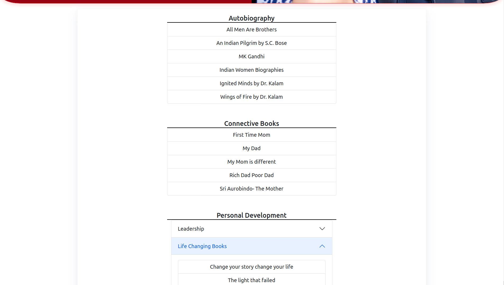
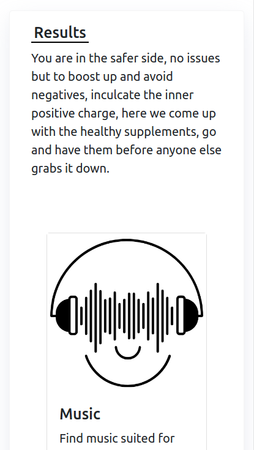
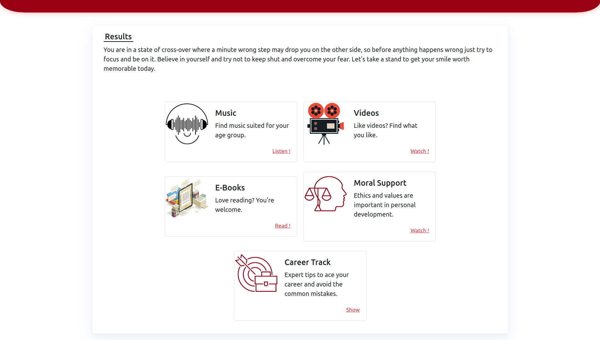

# FunEdu - an education repository

- Breaking the boundaries of exposure to social life and framing it rightfully.
- Making the digital life useful rather than wasting wasting time on something else.
- Shaping all mental odds using technology, i.e., LISTENING, VISUALISING, READING.
- Helping out teens to deal with the dark phases wisely in the time of crisis.


## Benefits of FunEdu
- **MORAL SUPPORT** - FunEdu tackels one of the most important problems of modern life - *Depression* by providing resources for motivating and uplifitng the child's mood
-  **MENTAL HEALTH** - The lockdown crisis caused a great impact one every teen's mind, funedu provides enough materials to cope up with the world, and also provide them resources that help shape a good personality.
-  **SPIRITUALITY** - In the age of smartphones where children might get easily influenced by social media influences or cutthroat competition... In any case discipline and piety will play an important role in defending them against these negative influences, rather the children will be able to decide the good and bad for themselves.
-  **Child-Parent Connection** - FunEdu also helps to close the gap between parents and their children by providing useful articles information, and help them build better connections in and after the lockdown.

## Upcoming Plans
- Finish the project and make it even more elaborate with more resources and better analysis with better quizes.
- Launching an app that provides equally snappy experience for users which would be easier for them to access on their phones.

## Gallery
<p align-items="center">



</p>
<!--
## Host React app on GitHub pages
`After linking you app to a github repo simply follow:`
### Install the gh-pages package as a _dev-dependency_ of the app.
In your app directory type:\
```
npm install gh-pages --save-dev
```
### Add some properties to the app's _package.json_ file.
At the top-level (i.e. inside package.json > right before/after/**in the same block as** the `"name"`) add the following:\
```
"homepage": "http://usrname.github.io/repo-name"
```
`usrname` name is your user-name at GitHub\
`repo-name` is the repository name that we are going to host on GitHub pages.
### In the existing scripts property, add a deploy property:
```
"scripts": {
  //...
  "deploy": "gh-pages -d build"
}
```
### Now run the following command:
```
npm run build
npm run deploy
```
And you are done now your react app will be hosted on GitHub pages !
## Available Scripts
In the project directory, you can run:
### `npm start`
Runs the app in the development mode.\
Open [http://localhost:3000](http://localhost:3000) to view it in the browser,\
or [http://localhost:3000](http://192.168.1.57:3000) to view it in the browser on your local network.
### `npm run build`
Builds the app for production to the `build` folder.\
It correctly bundles React in production mode and optimizes the build for the best performance.
The build is minified and the filenames include the hashes.\
Your app is ready to be deployed!
See the section about [deployment](https://facebook.github.io/create-react-app/docs/deployment) for more information.
### `npm run build` fails to minify
This section has moved here: [https://facebook.github.io/create-react-app/docs/troubleshooting#npm-run-build-fails-to-minify](https://facebook.github.io/create-react-app/docs/troubleshooting#npm-run-build-fails-to-minify) -->
